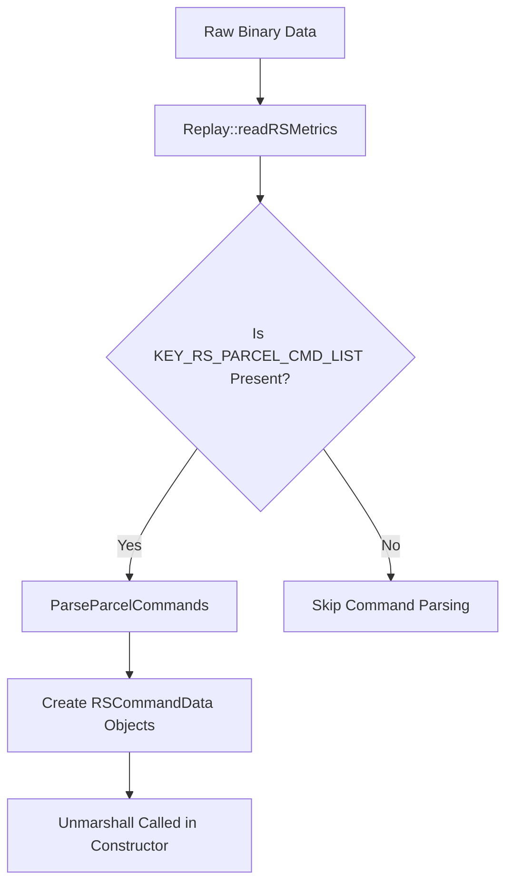
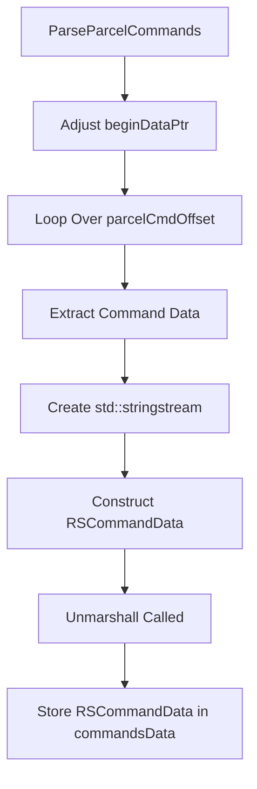
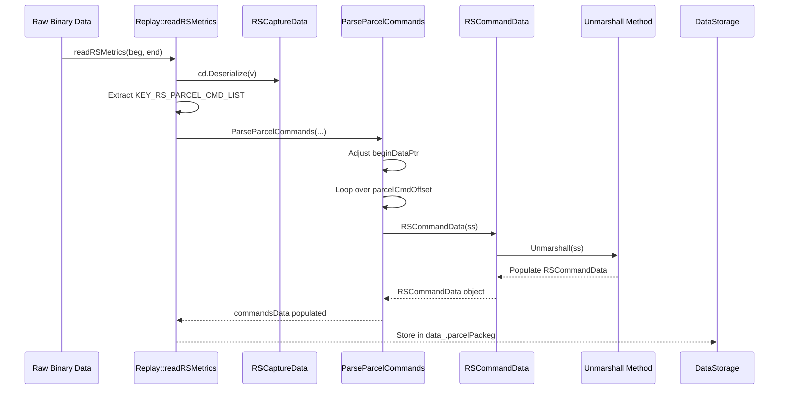
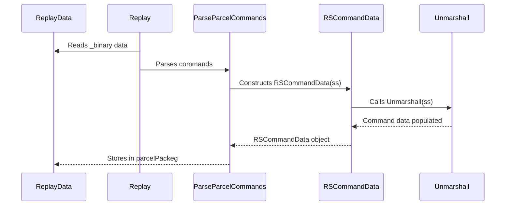

# Understanding How `Unmarshall` is Called in Your Codebase

## Overview

- **Objective:** Understand how `Unmarshall` is called in your application.
- **Approach:** Trace the data flow from reading raw data to the point where `Unmarshall` is invoked.
- **Key Components:**
  - **`ReplayData` Structure:** Holds various data vectors and metrics.
  - **`Replay` Class:** Manages reading data, parsing commands, and handling playback.
  - **`RSCommandData` Class:** Represents command data and calls `Unmarshall` in its constructor.

---

## 1. Understanding the Data Structures

### `ReplayData` Structure

```cpp
struct ReplayData
{
    struct ParcelPackage {
        std::vector<OHOS::Rosen::RSCommandData> parcelCommandsData;
        uint32_t parcelNumber;
    };

    std::vector<char> _header;
    std::vector<std::vector<char>> _binary;
    std::vector<ParcelPackage> parcelPackeg;
    // ... other members and metrics
};
```

- **Purpose:** Holds the replay data, including parcel packages containing command data.
- **Key Members:**
  - `_binary`: Stores binary data for each parcel.
  - `parcelPackeg`: A vector of `ParcelPackage`, each containing a list of `RSCommandData` objects.

---

## 2. Data Reading and Parsing in the `Replay` Class

### Data Flow Diagram



### `Replay::readRSMetrics` Method

```cpp
void Replay::readRSMetrics(const char* beg, const char* end)
{
    RSCaptureData cd;
    std::vector<char> v { beg, end };
    cd.Deserialize(v);
    data_._rsMetrics.timeRef().push_back(cd.GetTime());
    // ... other metrics

    if (const auto& rawProp = cd.GetProperty(RSCaptureData::KEY_RS_PARCEL_CMD_LIST);
        rawProp != "0" && rawProp != "") {
        auto parcelCmdOffsetStr = std::string(rawProp.begin(), rawProp.end());
        uint32_t numberParcelCmd = *reinterpret_cast<uint32_t*>(parcelCmdOffsetStr.data());
        std::vector<uint32_t> parcelCmdOffset(
            reinterpret_cast<uint32_t*>(parcelCmdOffsetStr.data()) + 1,
            reinterpret_cast<uint32_t*>(parcelCmdOffsetStr.data() + parcelCmdOffsetStr.size()));
        std::vector<OHOS::Rosen::RSCommandData> rsCommandData;
        ParseParcelCommands(rsCommandData, parcelCmdOffset, numberParcelCmd);
        data_.parcelPackeg.push_back({ std::move(rsCommandData), numberParcelCmd });
        // ... additional processing
    }
}
```

- **Purpose:** Reads RS metrics data and parses parcel commands if present.
- **Process:**
  - **Deserialization:** Converts raw data into an `RSCaptureData` object.
  - **Property Extraction:** Retrieves `KEY_RS_PARCEL_CMD_LIST` from `RSCaptureData`.
  - **Command Parsing:** Calls `ParseParcelCommands` to parse the command data.
  - **Data Storage:** Stores the parsed commands in `data_.parcelPackeg`.

---

## 3. Parsing Commands in `ParseParcelCommands`

### Data Flow Diagram



### `Replay::ParseParcelCommands` Method

```cpp
void Replay::ParseParcelCommands(
    std::vector<OHOS::Rosen::RSCommandData>& commandsData,
    const std::vector<uint32_t>& parcelCmdOffset, size_t num)
{
    char* beginDataPtr = data_._binary[num - 1].data();
    size_t sizeData = static_cast<size_t>(
        data_._binaryMetrics.metricRef(ReplayData::KeyBinaryPackageSize)[num - 1]);

    // Adjust the pointer to the start of command data
    beginDataPtr += sizeof(double) + sizeof(pid_t) + sizeof(uint32_t) * 3;

    commandsData.reserve(parcelCmdOffset.size());
    std::stringstream ss(std::ios::in | std::ios::out | std::ios::binary);
    for (size_t i = 0; i < parcelCmdOffset.size(); i++) {
        char* end = (i + 1 != parcelCmdOffset.size())
            ? beginDataPtr + parcelCmdOffset[i + 1]
            : beginDataPtr + sizeData;

        // Prepare the stringstream with the command data
        ss.str("");
        ss.clear();
        std::string str(beginDataPtr + parcelCmdOffset[i], end);
        ss << str;

        // Construct RSCommandData, which calls Unmarshall(ss)
        commandsData.emplace_back(ss);
    }
}
```

- **Purpose:** Parses individual commands from the binary data and creates `RSCommandData` objects.
- **Process:**
  - **Data Pointer Setup:**
    - Adjusts `beginDataPtr` to point to the actual command data within the binary package.
    - Skips over the initial metadata (timestamps, IDs, etc.).
  - **Command Extraction Loop:**
    - Iterates over `parcelCmdOffset` to extract each command's data.
    - Uses offsets to determine the start and end of each command.
    - Creates a `std::stringstream` with the command data.
  - **RSCommandData Construction:**
    - Constructs an `RSCommandData` object by passing the `std::stringstream`.
    - This invokes the `RSCommandData` constructor that calls `Unmarshall(ss)`.
  - **Data Storage:**
    - Appends the new `RSCommandData` object to `commandsData`.

#### Where `Unmarshall` Is Called

- **Invocation Point:** `commandsData.emplace_back(ss);`
- **Explanation:** This line constructs an `RSCommandData` object using the `std::stringstream& ss` constructor, which internally calls `Unmarshall(ss)`.

---

## 4. The `RSCommandData` Constructor and `Unmarshall` Method

### Class Definition

```cpp
namespace OHOS::Rosen {
    class RSCommandData {
    public:
        RSCommandData(std::stringstream& ss) {
            Unmarshall(ss);
        }
        // ... other members and methods
    private:
        void Unmarshall(std::stringstream& ss);
        // ... other members
    };
}
```

- **Purpose:** Represents a command with data parsed from a stream.
- **Constructor:**
  - **Parameters:** Accepts a `std::stringstream& ss`.
  - **Functionality:** Calls `Unmarshall(ss)` to parse the command data from the stream.
- **`Unmarshall` Method:**
  - **Purpose:** Reads from the `std::stringstream` and populates the object's members.
  - **Process:** Parses the command type, subtype, node ID, and any additional data.

---

## 5. Tracing the Complete Logic End to End

### Data Flow Diagram



### Step-by-Step Flow

1. **Data Acquisition:**
   - **Source:** Raw binary data representing RS metrics is received (possibly from a file or network).
   - **Data:** Contains command offsets and command data.

2. **Reading RS Metrics:**
   - **Method:** `Replay::readRSMetrics(const char* beg, const char* end)`
   - **Process:**
     - **Deserialization:** Converts raw data into an `RSCaptureData` object.
     - **Property Retrieval:** Extracts `KEY_RS_PARCEL_CMD_LIST` which contains command offsets.
     - **Command Parsing:** Calls `ParseParcelCommands` with `rsCommandData`, `parcelCmdOffset`, and `numberParcelCmd`.

3. **Parsing Parcel Commands:**
   - **Method:** `Replay::ParseParcelCommands(...)`
   - **Process:**
     - **Data Pointer Adjustment:** Positions `beginDataPtr` to the start of command data.
     - **Iterating Over Commands:**
       - For each command offset, extracts the command data.
       - Constructs a `std::stringstream` with the command data.
       - Creates an `RSCommandData` object by passing the stream.

4. **RSCommandData Construction:**
   - **Constructor Called:** `RSCommandData(std::stringstream& ss)`
   - **Process:**
     - Calls `Unmarshall(ss)` to parse and populate the command data.

5. **Unmarshalling Command Data:**
   - **Method:** `RSCommandData::Unmarshall(std::stringstream& ss)`
   - **Process:**
     - Reads from the stream to set the command type, subtype, node ID, and other data.
     - Handles different command formats based on the type and subtype.

6. **Data Storage:**
   - **Commands Stored:** The parsed `RSCommandData` objects are stored in `data_.parcelPackeg`.
   - **Parcel Package Added:** A new `ParcelPackage` is created with the commands and added to `data_.parcelPackeg`.

---

## 6. Visualizing the Data Flow

### Sequence Diagram



---

## 7. Key Points and Insights

- **`Unmarshall` Invocation:**
  - **Directly Called In:** `RSCommandData` constructor when a `std::stringstream&` is passed.
  - **Occurs During:** Parsing of parcel commands in `ParseParcelCommands`.

- **Data Storage:**
  - **Commands Stored In:** `data_.parcelPackeg`, specifically in `parcelCommandsData`.

- **Command Parsing:**
  - **Offsets Used:** `parcelCmdOffset` provides positions to extract each command from the binary data.
  - **Data Extraction:**
    - Commands are extracted from `data_._binary` using calculated pointers.
    - Adjustments made for metadata sizes (e.g., timestamps, IDs).

---

## 8. Understanding the Role of Each Function

- **`readRSMetrics`:**
  - Reads RS metrics and initiates command parsing if parcel commands are present.

- **`ParseParcelCommands`:**
  - Extracts individual commands from the binary data based on offsets.
  - Constructs `RSCommandData` objects, leading to `Unmarshall` being called.

- **`RSCommandData` Constructor and `Unmarshall`:**
  - The constructor initializes the object by parsing data from the stream.
  - `Unmarshall` is responsible for the actual parsing logic.

---

## 9. Additional Considerations

- **Typographical Errors:**
  - **Variable Names:** Ensure consistency (e.g., `ParcelPackeg` should be `ParcelPackage`, `praselNumber` should be `parcelNumber`).
  - **Impact:** Typos can cause confusion and make the code harder to understand or debug.

- **Data Alignment and Safety:**
  - **Pointer Arithmetic:** Be cautious with casting and pointer arithmetic to avoid undefined behavior.
  - **Memory Alignment:** Ensure that the data structures align properly when casting to types like `uint32_t*`.

- **Error Handling:**
  - **Robustness:** Consider adding error checks when reading data and parsing commands to handle corrupted or unexpected data gracefully.

---

## 10. Conclusion

By tracing the data flow from reading raw metrics to parsing individual commands, we've identified where `Unmarshall` is called and how the logic operates end to end.

**Summary:**

- **`Unmarshall` is called in the `RSCommandData` constructor**, which is invoked in `ParseParcelCommands`.
- **Data Flow:**
  - Raw data ➞ `readRSMetrics` ➞ Extract command list ➞ `ParseParcelCommands` ➞ `RSCommandData` objects ➞ `Unmarshall` method.
- **Data Storage:** Parsed commands are stored in `data_.parcelPackeg` for later use.

---


